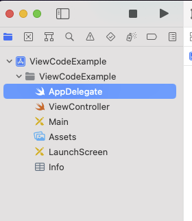
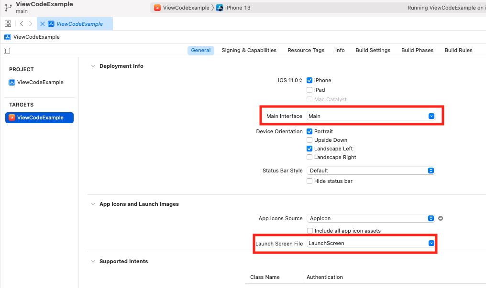
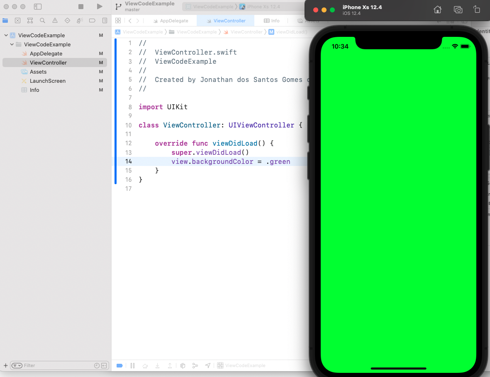
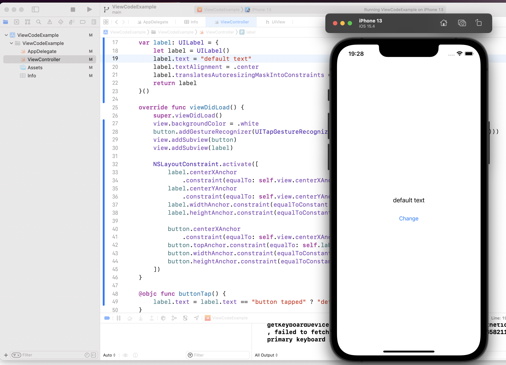

# View Code
[](README.md)
[](README.pt-br.md)


### What is View Code?

When you work on a versioned iOS project with **storyboards** or **xibs** view files, eventually you will face the not so pleasant task of merging these kinds of files.

Just by opening one of those files on *Xcode* it is possible that your versioning tool presents the file as changed. That happens because the IDE make its own files updates on the storyboards or xib files in order to present the visualization on **Interface Builder** (**IB**).

The storyboard and xib xml's structure is hard to maintain, with all the references created and managed by the IDE.

Those difficulties on working with storyboards and xibs are well known.

Using **SwiftUI**, a declarative view build framework available for projects with targets starting at iOS 13.0, as interface we can get those problems out of the table: the views are built in the Swift code, just like the rest of the app.

But what could be done for legacy apps and/or those apps that needs to keep compatibility with iOS versions prior to 13.0?

This gap can be filled by **View Code**.

Essentially,

    with View Code you design the views in Swift on a declarative way, just like with SwifUI but without using any frameworks or libs restricted to newer versions of the iOS SDK: you use the resources available in the good and old UIKit.
    
The table below is a <u>free comparison</u> done by observing the pros and cons of each view building option in iOS:


|               |Storyboard/Xib |SwiftUI|View Code  |
|:---           |:----:         |:----: |:----:     | 
|*Compatibility*| *iOS* 5+        |*iOS* 13+|*iOS* 2.0+   |
|*Maintainability*|**Low**, *IB* manages the XML files content and its inner structure makes merging harder |**High**, *view* in declarative code makes maintenance and working on versioned projects easier|**High**, *view* in declarative code makes maintenance and working on versioned projects easier|
|*View building easiness*|**High**, with *IB* and *auto layout*|**Medium**, you have a learning curve with the *framework*|**Low**, demands the dev to know views and (programmatically) constraints building using *UIKit*|
|*Layout creation feedback*|**Medium**, the feedback offered by *IB* for each change made on the layout is useful, but it may not represent the behavior observed while running the app on a simulator or device|**High**,  "Realtime" feedback of the changes (when *Xcode* previews works)|**None**, there isn't a *feedback* native option (UIKit only), although it's possible to use third party libraries for that|
|*Code verbosity|**Low**, the *Swift* code may be clean of the view implementation code, except for outlets and other bindings with the view components|**Yes**, *view* in declarative code increases code length|**Yes**, *view* in declarative code increases code length|


### View Code project setup
When you create a project on Xcode (with iOS 11 as target) you get the following project structure:



By default, when you choose *Storyboard* as your interface type, Xcode sets the `LaunchScreen.storyboard` and `Main.storyboard` as your app's entry point.



Although you can remove the “Main Interface” value, if you do the same for “Launch Screen File” the app won’t be full compatible with iOS versions before 13.0, so we going to let the launch storyboard file be.

For the app's entry point to be declared on code the following steps are needed:

1. On project's target settings, go to the "General" tab and remove the "Main Interface" value.
1. Set *window* and attribute a *View Controller* on *AppDelegate*:
    ```
    import UIKit

    @UIApplicationMain
    class AppDelegate: UIResponder, UIApplicationDelegate {
        var window: UIWindow?
        
        func application(_ application: UIApplication,
                        didFinishLaunchingWithOptions launchOptions: [UIApplication.LaunchOptionsKey: Any]?) -> Bool {
            window = UIWindow()
            window?.rootViewController = ViewController()
            window?.makeKeyAndVisible()
            return true
        }
    }
    ```
1. Remove the main default storyboard file.

For testing if this almost "storyboard free" app is working, set a different color for the background view of the ViewController: 
```
import UIKit

class ViewController: UIViewController {
    override func viewDidLoad() {
        super.viewDidLoad()
        view.backgroundColor = .green
    }
}
```
All done! A base version of an iOS app *almost* without storyboard or xib file (except for the launch storyboard):



### Creating a View

Let's create a simple view for the `ViewController`, containing a label and a button that changes the label value.
```
import UIKit

class ViewController: UIViewController {
    var button = UIButton(type: .system)
    var label = UILabel()
    
    override func viewDidLoad() {
        super.viewDidLoad()
        view.backgroundColor = .white
        
        button.setTitle("Change", for: .normal)
        button.addGestureRecognizer(UITapGestureRecognizer(target: self, action: #selector(buttonTap)))
        
        label.text = "default text"
        label.textAlignment = .center

        view.addSubview(button)
        view.addSubview(label)
    }
    
    @objc func buttonTap() {
        label.text = label.text == "button tapped" ? "default text" : "button tapped"
    }
}
```
The lines `view.addSubview(button)` and `view.addSubview(label)` adds the button and the label to the `ViewController`'s view hierarchy. But just adding the view elements won't do much for them to be rendered. To have the view elements rendered, it's necessary to set the sizes and positions with constraints.

And before that, for the constraints to actually work, you need to "turn off" the auto layout for those view elements, setting `translatesAutoresizingMaskIntoConstraints` to `false`.

For that, it's possible to turn the button and the label into computed properties, setting their properties on initialization:
```
class ViewController: UIViewController {
    var button: UIButton = {
        let button = UIButton(type: .system)
        button.setTitle("Change", for: .normal)
        button.translatesAutoresizingMaskIntoConstraints = false
        return button
    }()
    var label: UILabel = {
        let label = UILabel()
        label.text = "default text"
        label.textAlignment = .center
        label.translatesAutoresizingMaskIntoConstraints = false
        return label
    }()
    ...
}
```
Then you can set *constraints* for view elements **after you add them to its hierarchy** (addSubview):
```
override func viewDidLoad() {
    ...
    view.addSubview(button)
    view.addSubview(label)
    
    NSLayoutConstraint.activate([
        label.widthAnchor.constraint(equalToConstant: 200),
        label.heightAnchor.constraint(equalToConstant: 30),
        button.widthAnchor.constraint(equalToConstant: 200),
        button.heightAnchor.constraint(equalToConstant: 50)
    ])
}
```
`NSLayoutConstraint.activate` receives an array of constraints for activation. Each element inheriting from `UIView` has anchors attributes that makes the constraints definition easier. That is the case of `UILabel` and `UIButton`. You can use `widthAnchor` and `heightAnchor` to set the size of those view elements.
```
override func viewDidLoad() {
    super.viewDidLoad()
    view.backgroundColor = .white
    button.addGestureRecognizer(UITapGestureRecognizer(target: self, action: #selector(buttonTap)))
    view.addSubview(button)
    view.addSubview(label)
    
    NSLayoutConstraint.activate([
        label.centerXAnchor
            .constraint(equalTo: self.view.centerXAnchor, constant: 0),
        label.centerYAnchor
            .constraint(equalTo: self.view.centerYAnchor, constant: 0),
        label.widthAnchor.constraint(equalToConstant: 200),
        label.heightAnchor.constraint(equalToConstant: 30),
        
        button.centerXAnchor
            .constraint(equalTo: self.view.centerXAnchor, constant: 0),
        button.topAnchor.constraint(equalTo: self.label.bottomAnchor, constant: 10),
        button.widthAnchor.constraint(equalToConstant: 200),
        button.heightAnchor.constraint(equalToConstant: 50),
    ])
}
```
The anchors `centerXAnchor` and `centerYAnchor` can be bound to the equivalent anchors in the `ViewController`'s view. Setting a constant of 0 for those constraints, you get an element centralized on the view's x and y axis.

The button's anchor `topAnchor` bound to the label's `bottomAnchor` sets a constraints placing the button bellow the label at a distance of 10.

With those constraints set, this is the result you get:


```
import UIKit

class ViewController: UIViewController {
    var button: UIButton = {
        let button = UIButton(type: .system)
        button.setTitle("Change", for: .normal)
        button.translatesAutoresizingMaskIntoConstraints = false
        return button
    }()
    var label: UILabel = {
        let label = UILabel()
        label.text = "default text"
        label.textAlignment = .center
        label.translatesAutoresizingMaskIntoConstraints = false
        return label
    }()
    
    override func viewDidLoad() {
        super.viewDidLoad()
        view.backgroundColor = .white
        button.addGestureRecognizer(UITapGestureRecognizer(target: self, action: #selector(buttonTap)))
        view.addSubview(button)
        view.addSubview(label)
        
        NSLayoutConstraint.activate([
            label.centerXAnchor
                .constraint(equalTo: self.view.centerXAnchor, constant: 0),
            label.centerYAnchor
                .constraint(equalTo: self.view.centerYAnchor, constant: 0),
            label.widthAnchor.constraint(equalToConstant: 200),
            label.heightAnchor.constraint(equalToConstant: 30),
            
            button.centerXAnchor
                .constraint(equalTo: self.view.centerXAnchor, constant: 0),
            button.topAnchor.constraint(equalTo: self.label.bottomAnchor, constant: 10),
            button.widthAnchor.constraint(equalToConstant: 200),
            button.heightAnchor.constraint(equalToConstant: 50),
        ])
    }
    
    @objc func buttonTap() {
        label.text = label.text == "button tapped" ? "default text" : "button tapped"
    }
}
```

### Cleaning the code
Defining the view's elements and constraints on code can make it harder to understand.

In the example, we added just 2 elements to the view, but that is not the case in real world applications where the views are much more complex. In those cases, setting all the elements in the `ViewController` would make you code very coupled, decreasing its maintainability.

With View Code it's very much possible to better separate the View's and the ViewController's responsibilities.

The view code can be extracted into a separated class:
```
import UIKit

class ExampleView: UIView {
    var button: UIButton = {
        let button = UIButton(type: .system)
        button.setTitle("Change", for: .normal)
        button.translatesAutoresizingMaskIntoConstraints = false
        return button
    }()
    var label: UILabel = {
        let label = UILabel()
        label.text = "default text"
        label.textAlignment = .center
        label.translatesAutoresizingMaskIntoConstraints = false
        return label
    }()
    
    // MARK: - init
    override init(frame: CGRect = .zero) {
        super.init(frame: frame)
        self.setupViewCodeElements()
    }
    required init?(coder: NSCoder) {
        super.init(coder: coder)
    }
    
    @objc func buttonTap() {
        label.text = label.text == "button tapped" ? "default text" : "button tapped"
    }
}

extension ExampleView {
    func setupViewCodeElements() {
        self.backgroundColor = .white
        
        button.addGestureRecognizer(UITapGestureRecognizer(target: self, action: #selector(buttonTap)))
        self.addSubview(button)
        self.addSubview(label)
        
        NSLayoutConstraint.activate([
            label.centerXAnchor
                .constraint(equalTo: self.centerXAnchor, constant: 0),
            label.centerYAnchor
                .constraint(equalTo: self.centerYAnchor, constant: 0),
            label.widthAnchor.constraint(equalToConstant: 200),
            label.heightAnchor.constraint(equalToConstant: 30),
            
            button.centerXAnchor
                .constraint(equalTo: self.centerXAnchor, constant: 0),
            button.topAnchor.constraint(equalTo: self.label.bottomAnchor, constant: 10),
            button.widthAnchor.constraint(equalToConstant: 200),
            button.heightAnchor.constraint(equalToConstant: 50),
        ])
    }
}
```
Then, the `ViewController`:
```
import UIKit

class ViewController: UIViewController {
    var exampleView: ExampleView = ExampleView()
    
    override func viewDidLoad() {
        super.viewDidLoad()
        self.view = exampleView
    }
}
```
### Setting a pattern
For a team project, it's ideal to follow a pattern so you don't have to deal with many concurrent implementations.

For View Code, it's possible to define a `protocol` to include constraints and defining constants for them:

```
import Foundation

// MARK: - ViewCodeProtocol
protocol ViewCodeProtocol {
    func setupViewCodeElements()
    func setupElementsHierarchy()
    func setupConstraints()
    func extraSetup()
}

// MARK: - ViewCodeProtocol default implementation
extension ViewCodeProtocol {
    func setupViewCodeElements() {
        setupElementsHierarchy()
        setupConstraints()
        extraSetup()
    }
    func extraSetup() {}
}

protocol ViewCodeConstraintsProtocol {
    func setupConstraints()
}
```
The `ViewCodeProtocol` defines 4 methods: 
* `setupViewCodeElements`: protocol's 'main' method.
* `setupElementsHierarchy`: for adding elements to the view's hierarchy.
* `setupConstraints`: for defining constraints.
* `extraSetup`: for further view elements settings.

The extension of `ViewCodeProtocol` sets a default implementation for the method `setupViewCodeElements` defining an order of execution for the other protocols methods. It is encouraged then to add the elements to the hierarchy (`setupElementsHierarchy`) before setting their constraints (`setupConstraints`).

The extension also sets an empty default implementation for `extraSetup` so any item implementing the protocol is not obliged to implement this method.

The `ViewCodeConstraintsProtocol` sets the `setupConstraints` for defining constraints.


`ExampleView` implementing `ViewCodeProtocol`
```
import UIKit

class ExampleView: UIView {
    var button: UIButton = {
        let button = UIButton(type: .system)
        button.setTitle("Change", for: .normal)
        button.translatesAutoresizingMaskIntoConstraints = false
        return button
    }()
    var label: UILabel = {
        let label = UILabel()
        label.text = "default text"
        label.textAlignment = .center
        label.translatesAutoresizingMaskIntoConstraints = false
        return label
    }()
    
    // MARK: - init
    override init(frame: CGRect = .zero) {
        super.init(frame: frame)
        self.setupViewCodeElements()
    }
    required init?(coder: NSCoder) {
        super.init(coder: coder)
    }
    
    @objc func buttonTap() {
        label.text = label.text == "button tapped" ? "default text" : "button tapped"
    }
}

// MARK: extensions - ViewCode
extension ExampleView: ViewCodeProtocol {
    func setupElementsHierarchy() {
        self.addSubview(button)
        self.addSubview(label)
    }
    func extraSetup() {
        self.backgroundColor = .white
        button.addGestureRecognizer(UITapGestureRecognizer(target: self, action: #selector(buttonTap)))
    }
}
```

`ExampleView` extension implementing `ViewCodeConstraintsProtocol`:
```
// MARK: extensions - Constraints
extension ExampleView: ViewCodeConstraintsProtocol {
    func setupConstraints() {
        setupLabelConstraints()
        setupButtonConstraints()
    }
    
    func setupLabelConstraints() {
        NSLayoutConstraint.activate([
            label.centerXAnchor
                .constraint(equalTo: self.centerXAnchor, constant: 0),
            label.centerYAnchor
                .constraint(equalTo: self.centerYAnchor, constant: 0),
            label.widthAnchor.constraint(equalToConstant: 200),
            label.heightAnchor.constraint(equalToConstant: 30)
        ])
    }
    func setupButtonConstraints() {
        NSLayoutConstraint.activate([
            button.centerXAnchor
                .constraint(equalTo: self.centerXAnchor, constant: 0),
            button.topAnchor.constraint(equalTo: self.label.bottomAnchor, constant: 10),
            button.widthAnchor.constraint(equalToConstant: 200),
            button.heightAnchor.constraint(equalToConstant: 50),
        ])
    }
}
```
## Bonus: Using *Case-less enums*, *associatedtypes* and *SwiftLint* on View Code projects


### *Case-less enums* and *associatedtypes*
The place where you define the values for the constants may be a point of concern. For the example, the values are being defined as it is set as parameters for the constraint's anchors.

It's possible to improve the code readability and establish a pattern for defining constants using *case-less enums* and *associatedtype*

*Case-less enums* offers an option for the absence of namespaces in Swift. A namespace is a group of names with a common use, for the example a namespace for dimensions and another for margins may be needed. You can define an *associatedtype* for each of those constraint types:

```
protocol ViewCodeConstraintsProtocol {
    associatedtype Dimens: CaseIterable
    associatedtype Margins: CaseIterable
    func setupConstraints()
}
```
With those `associatedtypes` the protocol's implementations must set *enums* for `Dimens` and `Margins`:

```
import UIKit

// MARK: extensions - Constraints
extension ExampleView: ViewCodeConstraintsProtocol {
    enum Dimens: CaseIterable {
        enum Label {
            static let width: CGFloat = 200
            static let height: CGFloat = 30
        }
        enum Button {
            static let width: CGFloat = 200
            static let height: CGFloat = 50
        }
    }
    enum Margins: CaseIterable {
        enum Label {
            static let centerX: CGFloat = 0
            static let centerY: CGFloat = 0
        }
        enum Button {
            static let top: CGFloat = 0
            static let centerX: CGFloat = 0
        }
    }
    
    func setupConstraints() {
        setupLabelConstraints()
        setupButtonConstraints()
    }
    
    func setupLabelConstraints() {
        NSLayoutConstraint.activate([
            label.centerXAnchor
                .constraint(equalTo: self.centerXAnchor,
                            constant: Margins.Label.centerX),
            label.centerYAnchor
                .constraint(equalTo: self.centerYAnchor,
                            constant: Margins.Label.centerY),
            label.widthAnchor
                .constraint(equalToConstant: Dimens.Label.width),
            label.heightAnchor
                .constraint(equalToConstant: Dimens.Label.height)
        ])
    }
    func setupButtonConstraints() {
        NSLayoutConstraint.activate([
            button.centerXAnchor
                .constraint(equalTo: self.centerXAnchor,
                            constant: Margins.Button.centerX),
            button.topAnchor
                .constraint(equalTo: self.label.bottomAnchor,
                            constant: Margins.Button.top),
            button.widthAnchor
                .constraint(equalToConstant: Dimens.Button.width),
            button.heightAnchor
                .constraint(equalToConstant: Dimens.Button.height)
        ])
    }
}
```
### Constraint pattern x SwiftLint
When the constraints are set on nested enums like at the example, another problem may come if the project is using SwiftLint.

SwiftLint has a default rule called `nesting`, which sets that the code can only 1 level of nesting for `type`s.
```
struct Example { // "root" level
    struct GoodNestedExample { // default accepted nesting level
        struct BadNestedExample { // error: Nesting violation. Types should be nested at most 1 level deep
        ...
        }
    }
}
```
Theoretically, this SwiftLint validation is needed to avoid "Pyramid of Doom", a code with so many nested items that becomes harder to understand.

To be able to use the suggest patter with nested *case-less enums*, we need to set a custom configuration for the `nesting` rule in the `.swiftlint.yml` file:

```
...
nesting:
  type_level:
    warning: 2
...
```
With this set, an enum (or any other type) can have one more nesting level, the needed value for the suggest pattern.


## Conclusion
Developing with View Code provide both advantage and impose challenges. While on one hand we get a more refined control over the view implementation process and improving in maintainability, on the other we must deal with manual constraints settings, the need to build the app to view the changes on the absence of a native preview option and the increase at code size.

To make it easier to work with constraints, it's possible to define patterns with protocols, case-less enums and associatedtypes so the view code can get cleaner and scalable.

This post's example is limited to the UIKit resources, but it is also possible to use third parties libraries such as [Snapkit](https://github.com/SnapKit/SnapKit) and [snapshot tests](https://github.com/ashfurrow/Nimble-Snapshots) to ease the process of setting constraints and viewing the changes.
