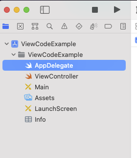
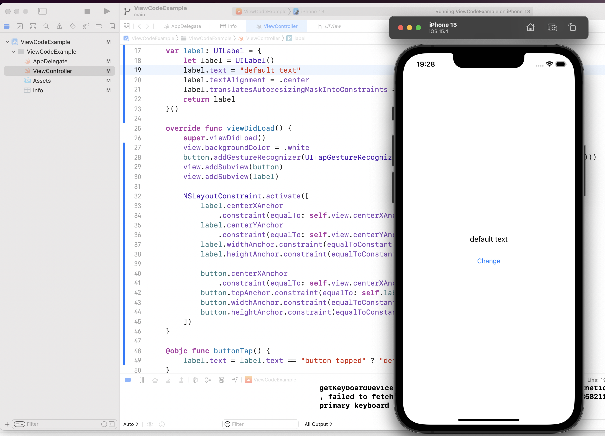

# View Code
[](README.md)
[](README.pt-br.md)


### O que é View Code?

Quando trabalhamos em projetos *iOS* versionados com *views* em **storyboards** ou **xibs**, eventualmente nos deparamos com a dura tarefa de fazer *merge* desses tipos de aquivos.

Apenas por abrimos um desses arquivos no *Xcode* já é possível que sua ferramenta de versionamento apresente o arquivo como alterado, uma vez que a *IDE* faz atualizações no arquivo para simples visualização no ***Interface Builder* (*IB*)**.

A estrutura interna dos *xmls* dos *storyboards* e *xibs* é de difícil manutenção, com referências criadas e geridas pela *IDE*.

Essas dificuldades de trabalhar com *storyboards* e *xibs* são conhecidas.

Usando como interface o ***SwiftUI***, um *framework* de construção de *views* de forma declarativa que está disponível para projetos com *target* de *iOS* 13.0 em diante, eliminamos esses problemas: as *views* são construídas em código *Swift* assim como todo o resto da aplicação.

Mas o que pode ser feito para apps legados e/ou que tenham a necessidade de manter compatibilidade com *iOS* anterior a versão 13.0?

Nesse nicho se encaixa o ***View Code***.

Basicamente,
    
    com View Code as views são construídas de forma declarativa em Swift assim como no SwiftUI, porém sem usar frameworks ou libs restritas às versões mais novas do SDK do iOS: usa-se os recursos disponíveis na boa e velha UIKit.

A tabela a seguir é uma <u>comparação livre</u> feita observando prós/contras de cada opção para a construção de *view* em *iOS*:

|               |Storyboard/Xib |SwiftUI|View Code  |
|:---           |:----:         |:----: |:----:     | 
|*Compatibilidade*| *iOS* 5+        |*iOS* 13+|*iOS* 2.0+   |
|*Facilidade para manter código*|**Baixa**, o *IB* gerencia o conteúdo dos arquivos XML de *views* e a estrutura interna dificulta *merges* |**Alta**, *view* em código declarativo facilita a manutenção e o trabalho em projeto versionado|**Alta**, *view* em código declarativo facilita a manutenção e o trabalho em projeto versionado|
|*Facilidade para construir layout*|**Alta**, com *IB* e *auto layout*|**Média**, possui curva para aprendizagem do *framework*|**Baixa**, exige que o desenvolvedor conheça a construção de *views* e *constraints* usando *UIKit*|
|*Feedback na criação do layout*|**Médio**, o *feedback* oferecido pelo *IB* para cada alteração realizada no *layout* da *view* é útil, mas pode não refletir o comportamento observado ao rodar o app em um simulador ou dispositivo|**Alto**,  *feedback* "em tempo real" das alterações (quando o *Xcode* colabora)|**Não** temos uma opção de *feedback* nativo (usando somente UIKit), é possível usar *libs* terceiras para isso
|*Código "verboso"?*|**Não**, o código *Swift* pode ficar limpo do que é construção de *View*, exceto por *outlets* e outras ligações feitas com os componentes da *view* |**Sim**, *view* em código declarativo aumenta a quantidade de código|**Sim**, *view* em código declarativo aumenta a quantidade de código|


### Configuração de projeto usando View Code
Ao criarmos um projeto no Xcode (target iOS 11) temos a seguinte estrutura:


Por padrão, ao escolher *Storyboard* como tipo de view (opção *interface* ao criar um projeto), o XCode define os arquivos `LaunchScreen.storyboard` e `Main.storyboard` como entradas do app.


Para que a entrada do app seja declarada em código é necessário:
1. Remover o conteúdo dos campos "*Main Interface*" e "*Launch Screen File*" na aba "*General*" no *target* do projeto;
1. Definir *window* e *View Controller* no *AppDelegate*:
    ```
    import UIKit

    @UIApplicationMain
    class AppDelegate: UIResponder, UIApplicationDelegate {
        var window: UIWindow?
        
        func application(_ application: UIApplication,
                        didFinishLaunchingWithOptions launchOptions: [UIApplication.LaunchOptionsKey: Any]?) -> Bool {
            window = UIWindow()
            window?.rootViewController = ViewController()
            window?.makeKeyAndVisible()
            return true
        }
    }
    ```
1. Remover o parâmetro "*Launch screen interface file base name*" do arquivo `Info.plist`:
    

1. Adicionar o parâmetro "*Launch Screen*", definindo uma imagem para a tela de carregamento do app:
    

1. Finalmente, remover os dois aquivos padrão de *storyboard*.

Para o teste da entrada no nosso app "*storyboard free*", 
```
import UIKit

class ViewController: UIViewController {
    override func viewDidLoad() {
        super.viewDidLoad()
        view.backgroundColor = .green
    }
}
```
Pronto, uma versão base de um app sem nenhum xib ou storyboard:


### Criando uma View

Vamos fazer uma *view* simples para a *ViewController* que contenha uma *label* e um botão que faz o texto da *label* mudar.
```
import UIKit

class ViewController: UIViewController {
    var button = UIButton(type: .system)
    var label = UILabel()
    
    override func viewDidLoad() {
        super.viewDidLoad()
        view.backgroundColor = .white
        
        button.setTitle("Change", for: .normal)
        button.addGestureRecognizer(UITapGestureRecognizer(target: self, action: #selector(buttonTap)))
        
        label.text = "default text"
        label.textAlignment = .center

        view.addSubview(button)
        view.addSubview(label)
    }
    
    @objc func buttonTap() {
        label.text = label.text == "button tapped" ? "default text" : "button tapped"
    }
}
```
As linhas `view.addSubview(button)` e `view.addSubview(label)` incluem o botão e a *label* na hierarquia de *views* da `ViewController`. Porém apenas adicionar os elementos não dará condições dos mesmos serem renderizados. Para isso é necessário determinar tamanhos e posicionamentos com *constraints*.

Mas para que as *constraints* determinadas em código funcionem, é preciso "desligar" o *auto layout* para os elementos de *views*, definindo o `translatesAutoresizingMaskIntoConstraints` para `false`.

É possível alterar o botão e a *label* para *computed properties*, definindo os parâmetros de cada um na inicialização:
```
class ViewController: UIViewController {
    var button: UIButton = {
        let button = UIButton(type: .system)
        button.setTitle("Change", for: .normal)
        button.translatesAutoresizingMaskIntoConstraints = false
        return button
    }()
    var label: UILabel = {
        let label = UILabel()
        label.text = "default text"
        label.textAlignment = .center
        label.translatesAutoresizingMaskIntoConstraints = false
        return label
    }()
    ...
}
```
É possível definir as *constraints* dos elementos da view:
```
override func viewDidLoad() {
    ...
    view.addSubview(button)
    view.addSubview(label)
    
    NSLayoutConstraint.activate([
        label.widthAnchor.constraint(equalToConstant: 200),
        label.heightAnchor.constraint(equalToConstant: 30),
        button.widthAnchor.constraint(equalToConstant: 200),
        button.heightAnchor.constraint(equalToConstant: 50)
    ])
}
```
`NSLayoutConstraint.activate` recebe um *array* de *constraints* para ativar. Cada elemento que herda de `UIView` possui atributos de âncoras que facilitam a definição programática de *constraints*, é o caso de `UILabel` e `UIButton`. Podemos usar `widthAnchor` e `heightAnchor` para definir o tamanho dos dois elementos.
```
override func viewDidLoad() {
    super.viewDidLoad()
    view.backgroundColor = .white
    button.addGestureRecognizer(UITapGestureRecognizer(target: self, action: #selector(buttonTap)))
    view.addSubview(button)
    view.addSubview(label)
    
    NSLayoutConstraint.activate([
        label.centerXAnchor
            .constraint(equalTo: self.view.centerXAnchor, constant: 0),
        label.centerYAnchor
            .constraint(equalTo: self.view.centerYAnchor, constant: 0),
        label.widthAnchor.constraint(equalToConstant: 200),
        label.heightAnchor.constraint(equalToConstant: 30),
        
        button.centerXAnchor
            .constraint(equalTo: self.view.centerXAnchor, constant: 0),
        button.topAnchor.constraint(equalTo: self.label.bottomAnchor, constant: 10),
        button.widthAnchor.constraint(equalToConstant: 200),
        button.heightAnchor.constraint(equalToConstant: 50),
    ])
}
```
As âncoras `centerXAnchor` e `centerYAnchor` podem ser relacionadas com as âncoras equivalentes da *view* de `ViewController`. Definindo uma constante de 0 para essa *constraint*, temos o elemento centralizado no eixo x e y da *view*.

A âncora `topAnchor` de `button` relacionada a `bottomAnchor` de `label` define uma constraint que posiciona o botão abaixo da *label* com uma distância definida em 10.

Com as *constraints*, obtém-se o seguinte resultado:


```
import UIKit

class ViewController: UIViewController {
    var button: UIButton = {
        let button = UIButton(type: .system)
        button.setTitle("Change", for: .normal)
        button.translatesAutoresizingMaskIntoConstraints = false
        return button
    }()
    var label: UILabel = {
        let label = UILabel()
        label.text = "default text"
        label.textAlignment = .center
        label.translatesAutoresizingMaskIntoConstraints = false
        return label
    }()
    
    override func viewDidLoad() {
        super.viewDidLoad()
        view.backgroundColor = .white
        button.addGestureRecognizer(UITapGestureRecognizer(target: self, action: #selector(buttonTap)))
        view.addSubview(button)
        view.addSubview(label)
        
        NSLayoutConstraint.activate([
            label.centerXAnchor
                .constraint(equalTo: self.view.centerXAnchor, constant: 0),
            label.centerYAnchor
                .constraint(equalTo: self.view.centerYAnchor, constant: 0),
            label.widthAnchor.constraint(equalToConstant: 200),
            label.heightAnchor.constraint(equalToConstant: 30),
            
            button.centerXAnchor
                .constraint(equalTo: self.view.centerXAnchor, constant: 0),
            button.topAnchor.constraint(equalTo: self.label.bottomAnchor, constant: 10),
            button.widthAnchor.constraint(equalToConstant: 200),
            button.heightAnchor.constraint(equalToConstant: 50),
        ])
    }
    
    @objc func buttonTap() {
        label.text = label.text == "button tapped" ? "default text" : "button tapped"
    }
}
```

### Organizando o código
Com as definições de elementos da *view* e das *constraints* em `ViewController`, o código pode ficar de difícil legibilidade.

No exemplo, incluímos apenas 2 elementos, porém em casos reais as *views* são muito mais complexas e a definição de todos os elementos na *ViewController* deixaria o código acoplado e prejudicaria a manutenção.

Com o código em *View Code* é possível separar melhor as responsabilidades de *View* e *ViewController*.

O código de *view* pode ser separado:
```
import UIKit

class ExampleView: UIView {
    var button: UIButton = {
        let button = UIButton(type: .system)
        button.setTitle("Change", for: .normal)
        button.translatesAutoresizingMaskIntoConstraints = false
        return button
    }()
    var label: UILabel = {
        let label = UILabel()
        label.text = "default text"
        label.textAlignment = .center
        label.translatesAutoresizingMaskIntoConstraints = false
        return label
    }()
    
    // MARK: - init
    override init(frame: CGRect = .zero) {
        super.init(frame: frame)
        self.setupViewCodeElements()
    }
    required init?(coder: NSCoder) {
        super.init(coder: coder)
    }
    
    @objc func buttonTap() {
        label.text = label.text == "button tapped" ? "default text" : "button tapped"
    }
}

extension ExampleView {
    func setupViewCodeElements() {
        self.backgroundColor = .white
        
        button.addGestureRecognizer(UITapGestureRecognizer(target: self, action: #selector(buttonTap)))
        self.addSubview(button)
        self.addSubview(label)
        
        NSLayoutConstraint.activate([
            label.centerXAnchor
                .constraint(equalTo: self.centerXAnchor, constant: 0),
            label.centerYAnchor
                .constraint(equalTo: self.centerYAnchor, constant: 0),
            label.widthAnchor.constraint(equalToConstant: 200),
            label.heightAnchor.constraint(equalToConstant: 30),
            
            button.centerXAnchor
                .constraint(equalTo: self.centerXAnchor, constant: 0),
            button.topAnchor.constraint(equalTo: self.label.bottomAnchor, constant: 10),
            button.widthAnchor.constraint(equalToConstant: 200),
            button.heightAnchor.constraint(equalToConstant: 50),
        ])
    }
}
```
`ViewController`:
```
import UIKit

class ViewController: UIViewController {
    var exampleView: ExampleView = ExampleView()
    
    override func viewDidLoad() {
        super.viewDidLoad()
        self.view = exampleView
    }
}
```
### Definindo um padrão
Para um projeto em equipe, é ideal que um padrão seja seguido para que não seja necessário lidar com implementações concorrentes.

Para o *View Code*, é possível definir `protocol` para inclusão de *constraints* e para a definição das constantes:

```
import Foundation

// MARK: - ViewCodeProtocol
protocol ViewCodeProtocol {
    func setupViewCodeElements()
    func setupElementsHierarchy()
    func setupConstraints()
    func extraSetup()
}

// MARK: - ViewCodeProtocol default implementation
extension ViewCodeProtocol {
    func setupViewCodeElements() {
        setupElementsHierarchy()
        setupConstraints()
        extraSetup()
    }
    func extraSetup() {}
}

protocol ViewCodeConstraintsProtocol {
    func setupConstraints()
}
```
O protocolo `ViewCodeProtocol` define 4 métodos:
* `setupViewCodeElements`: método "principal" do protocolo;
* `setupElementsHierarchy`: para inclusão de elementos da *view* na hierarquia;
* `setupConstraints`: para definição de *constraints*;
* `extraSetup`: para demais configurações dos elementos de *view*;

A extensão padrão de `ViewCodeProtocol` define uma implementação padrão para `setupViewCodeElements` definindo uma ordem de execução dos demais métodos do protocolo. Dessa forma, é encorajado que os elementos sejam adicionados na hierarquia (`setupElementsHierarchy`) antes de definir as *constraints* (`setupConstraints`).

Na extensão também é definido `extraSetup` para que sua implementenção não seja obrigatória.

O protocolo `ViewCodeConstraintsProtocol` determina o metodo `setupConstraints` para a definição das *constraints*.


`ExampleView` implementando `ViewCodeProtocol`
```
import UIKit

class ExampleView: UIView {
    var button: UIButton = {
        let button = UIButton(type: .system)
        button.setTitle("Change", for: .normal)
        button.translatesAutoresizingMaskIntoConstraints = false
        return button
    }()
    var label: UILabel = {
        let label = UILabel()
        label.text = "default text"
        label.textAlignment = .center
        label.translatesAutoresizingMaskIntoConstraints = false
        return label
    }()
    
    // MARK: - init
    override init(frame: CGRect = .zero) {
        super.init(frame: frame)
        self.setupViewCodeElements()
    }
    required init?(coder: NSCoder) {
        super.init(coder: coder)
    }
    
    @objc func buttonTap() {
        label.text = label.text == "button tapped" ? "default text" : "button tapped"
    }
}

// MARK: extensions - ViewCode
extension ExampleView: ViewCodeProtocol {
    func setupElementsHierarchy() {
        self.addSubview(button)
        self.addSubview(label)
    }
    func extraSetup() {
        self.backgroundColor = .white
        button.addGestureRecognizer(UITapGestureRecognizer(target: self, action: #selector(buttonTap)))
    }
}
```

*Extension* de `ExampleView` implementando `ViewCodeConstraintsProtocol`:
```
// MARK: extensions - Constraints
extension ExampleView: ViewCodeConstraintsProtocol {
    func setupConstraints() {
        setupLabelConstraints()
        setupButtonConstraints()
    }
    
    func setupLabelConstraints() {
        NSLayoutConstraint.activate([
            label.centerXAnchor
                .constraint(equalTo: self.centerXAnchor, constant: 0),
            label.centerYAnchor
                .constraint(equalTo: self.centerYAnchor, constant: 0),
            label.widthAnchor.constraint(equalToConstant: 200),
            label.heightAnchor.constraint(equalToConstant: 30)
        ])
    }
    func setupButtonConstraints() {
        NSLayoutConstraint.activate([
            button.centerXAnchor
                .constraint(equalTo: self.centerXAnchor, constant: 0),
            button.topAnchor.constraint(equalTo: self.label.bottomAnchor, constant: 10),
            button.widthAnchor.constraint(equalToConstant: 200),
            button.heightAnchor.constraint(equalToConstant: 50),
        ])
    }
}
```
## Bônus: Usando *Case-less enums*, *associatedtypes* e *SwiftLint* em projetos View Code


### *Case-less enums* e *associatedtypes*
O local de definição dos valores das constantes podem ser um ponto de preocupação. No exemplo esses valores estão sendo definidos ao passar o parâmetro aos metodos *constraint* das âncoras.
É possível melhorar a legibilidade e estabelecer um padrão para a definição das constantes usando *case-less enums* e *associatedtype*

*Case-less enums* suprem uma carência da linguagem *Swift*: *namespaces*. Um *namespace* é um conjunto de nomes com uma utilização em comum, no exemplo é necessário um *namespace* para dimensões e outro para margens. É possível definirmos um *associatedtype* para cada um no protocolo de *constraints*:

```
protocol ViewCodeConstraintsProtocol {
    associatedtype Dimens: CaseIterable
    associatedtype Margins: CaseIterable
    func setupConstraints()
}
```
Com esses `associatedtypes` as implementações desse protocolo deverão definir os *enums* `Dimens` e `Margins`:

```
import UIKit

// MARK: extensions - Constraints
extension ExampleView: ViewCodeConstraintsProtocol {
    enum Dimens: CaseIterable {
        enum Label {
            static let width: CGFloat = 200
            static let height: CGFloat = 30
        }
        enum Button {
            static let width: CGFloat = 200
            static let height: CGFloat = 50
        }
    }
    enum Margins: CaseIterable {
        enum Label {
            static let centerX: CGFloat = 0
            static let centerY: CGFloat = 0
        }
        enum Button {
            static let top: CGFloat = 0
            static let centerX: CGFloat = 0
        }
    }
    
    func setupConstraints() {
        setupLabelConstraints()
        setupButtonConstraints()
    }
    
    func setupLabelConstraints() {
        NSLayoutConstraint.activate([
            label.centerXAnchor
                .constraint(equalTo: self.centerXAnchor,
                            constant: Margins.Label.centerX),
            label.centerYAnchor
                .constraint(equalTo: self.centerYAnchor,
                            constant: Margins.Label.centerY),
            label.widthAnchor
                .constraint(equalToConstant: Dimens.Label.width),
            label.heightAnchor
                .constraint(equalToConstant: Dimens.Label.height)
        ])
    }
    func setupButtonConstraints() {
        NSLayoutConstraint.activate([
            button.centerXAnchor
                .constraint(equalTo: self.centerXAnchor,
                            constant: Margins.Button.centerX),
            button.topAnchor
                .constraint(equalTo: self.label.bottomAnchor,
                            constant: Margins.Button.top),
            button.widthAnchor
                .constraint(equalToConstant: Dimens.Button.width),
            button.heightAnchor
                .constraint(equalToConstant: Dimens.Button.height)
        ])
    }
}
```
### Padrão de *constraints* x *SwiftLint*
Quando as constraints são definidas em *enums* aninhados um outro problema pode surgir quando o projeto usa *SwiftLint*.

O *SwiftLint* possui uma regra padrão chamada `nesting` que determina que o código pode ter até 1 nível de aninhamento:
```
struct Example { // "root" level
    struct GoodNestedExample { // default accepted nesting level
        struct BadNestedExample { // error: Nesting violation. Types should be nested at most 1 level deep
        ...
        }
    }
}
```
Em tese, essa validação do *SwiftLint* é necessária para evitar *Pyramid of Doom*, um código com tanto aninhamento que dificulta o entendimento.

Para conseguirmos usar o padrão sugerido com *case-less enums* aninhados, precisamos estabelecer uma configuração customizada para essa regra no arquivo `.swiftlint.yml`:

```
...
nesting:
  type_level:
    warning: 2
...
```
Dessa forma um tipo (como um *enum*) pode passar a ter mais um nível de aninhamento, o necessário para usarmos o padrão sugerido.


## Conclusão
O desenvolvimento com *View Code* fornece vantagens e impõe desafios. Se por um lado temos um controle mais refinado da construção da interface de usuário e uma melhora na manutenabilidade do código da view, por outro temos que lidar com a definição manual de *constraints*, a necessidade de um novo *build* para visualizar as mudanças na falta de um *preview nativo* e o aumento da quantidade de código.

Para facilitar o trabalho com *constraints* é possível estabelecer padrões com protocolos, *case-less enums* e *associatedtypes* para que o código da *view *seja mais limpo e organizado e mais facil de escalar.

O exemplo desse *post* limitou-se apenas ao uso de recursos da *UIKit*, mas também é possível usar libs terceiras como [*Snapkit*](https://github.com/SnapKit/SnapKit) e o [testes de *snapshot*](https://github.com/ashfurrow/Nimble-Snapshots) para facilitar a definição de *constraints* e a visualização do *layout* construído.
